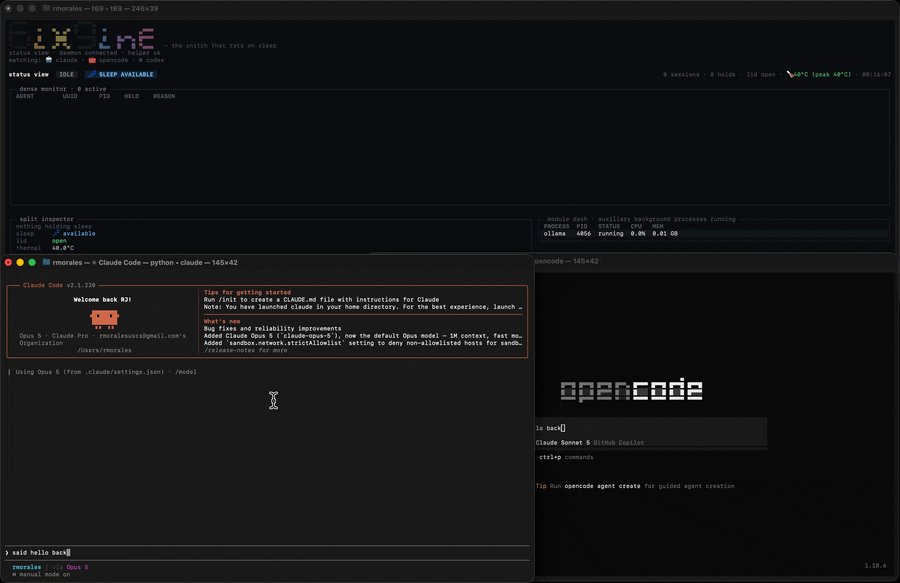
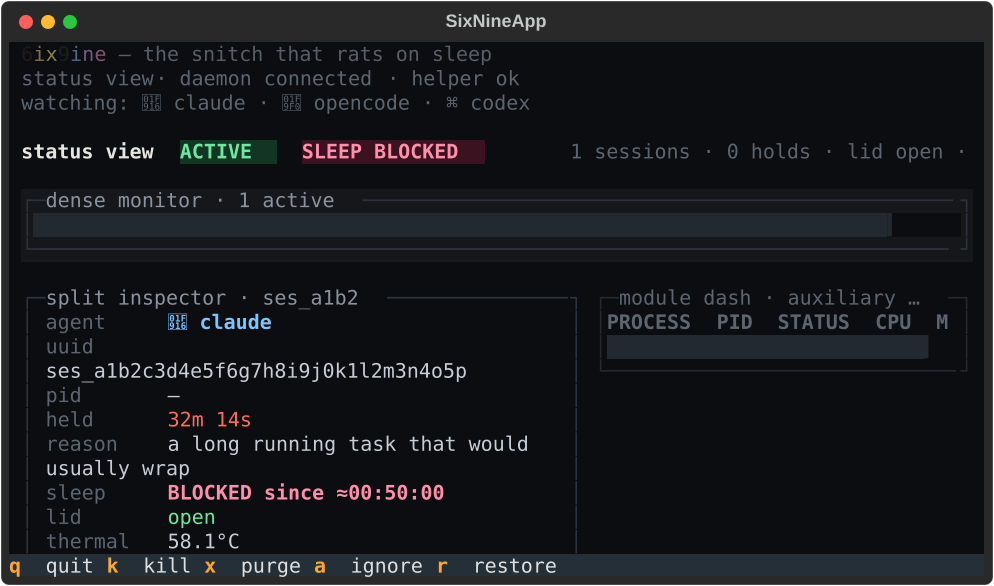
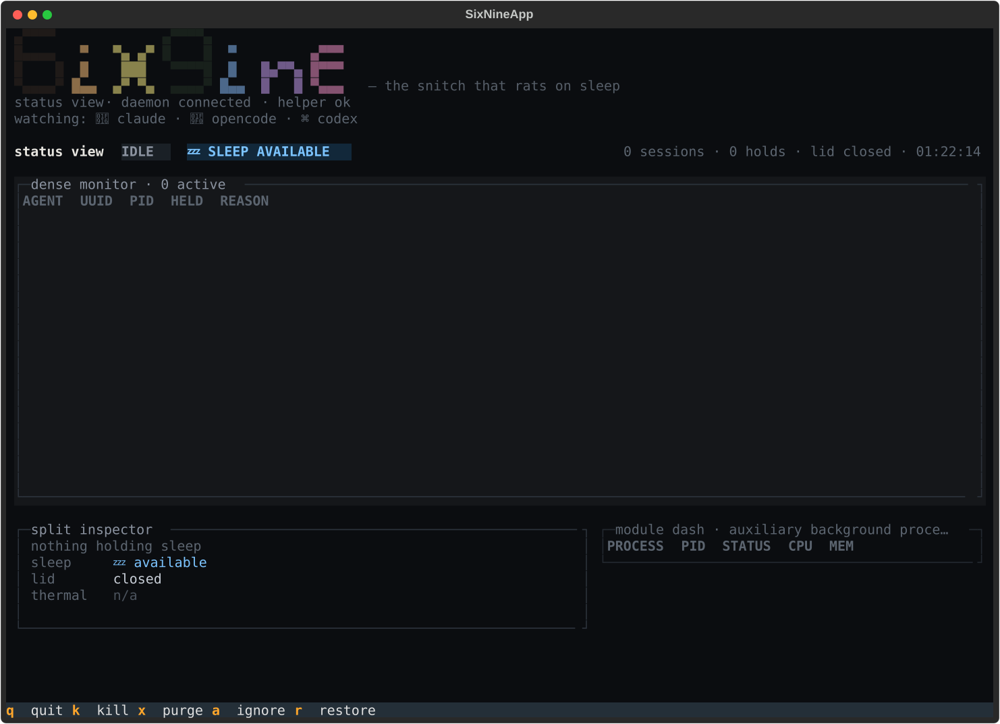

# 6ix9ine

> **Sleep management for AI agents.**
> The snitch that rats on sleep 🐀 — keeps your Mac awake only while work is happening, then lets it go back to sleep like nothing ever happened.

[](https://opensource.org/licenses/MIT)
[](#-requirements)
[](#-homebrew-recommended)



*Agent starts → `🚫 SLEEP BLOCKED`. Last agent finishes → `💤 SLEEP AVAILABLE`. No toggles, no cleanup.*

---

## Never lose another overnight run

Your agent works for hours. Your Mac sleeps after fifteen minutes.

You kick off a long Claude Code refactor, dock the laptop, close the lid — and macOS puts the whole machine to sleep. You come back to a dead session and half-finished work.

The usual fixes are blunt instruments:

- `caffeinate` dies with your terminal and doesn't survive a closed lid.
- "Never sleep" apps keep your Mac awake 24/7 whether it's working or not.

6ix9ine ties wakefulness to **actual work**. Sleep is blocked only while an agent session is running, and released automatically the moment the last one ends. Install once, forget it exists.

## Why not `caffeinate`?

Because `caffeinate` never knows when you're done.

You start it. You stop it. Forget it running and your laptop stays awake till morning. Forget to start it and your agent run dies at the lid close. And plain `caffeinate` won't block sleep on a docked Mac with the lid shut — that needs `pmset disablesleep`, which needs root.

6ix9ine follows your work automatically: agents call `acquire` when they start and `release` when they finish, a reference counter tracks how many are live, and sleep is blocked only while that count is above zero — clamshell included.

## How it compares

| | `caffeinate` | Amphetamine | **6ix9ine** |
|---|:---:|:---:|:---:|
| Auto-detects AI agent sessions | ❌ | ❌ | ✅ |
| Releases sleep when work ends | ❌ | ⚠️ manual/timer | ✅ automatic |
| Multiple concurrent sessions | ❌ | ❌ | ✅ reference-counted |
| Crash-safe (no leaked wake locks) | ❌ | ❌ | ✅ |
| Docked clamshell (lid closed) | ❌ | ⚠️ partial | ✅ |
| Live terminal dashboard | ❌ | ❌ | ✅ `t69` |
| Free + fully auditable | ✅ | ❌ closed-source | ✅ MIT |

## Who it's for

Built for people running long, hands-off work on a Mac:

- ✅ **Claude Code** and **OpenCode** — auto-detected via hooks, zero config
- ✅ Overnight AI coding, model training, or batch jobs
- ✅ Long Docker builds, data pipelines, render jobs — anything, via manual `acquire`/`release`
- ✅ Docked MacBooks running with the lid closed
- 🔄 Codex CLI and Antigravity (`agy`) — hook integration in progress

---

## ⚙️ Requirements

| Install method | What you need |
|---|---|
| **Homebrew** (recommended) | macOS 14+ — and nothing else. The binaries are self-contained, so **you do not need Python installed.** |
| **From source** | macOS 14+ and Python 3.13+ (what `install.sh` looks for). |

> **macOS only, for now.** 6ix9ine is built directly on macOS power management — `pmset disablesleep`, IOKit sleep assertions, LaunchAgents and LaunchDaemons — so there's no Linux or Windows build today.
>
> Want one? [Open a feature request →](https://github.com/rjmorales13/6ix9ine/issues/new) Whether it gets built comes down to whether people actually ask for it, and right now there's no signal either way. The reference-counting and hook layers are platform-agnostic; it's the sleep-blocking layer that would need a per-OS implementation.

## 🚀 Getting Started

### 🍺 Homebrew (recommended)

```bash
brew install rjmorales13/6ix9ine/6ix9ine
```

Real Homebrew, real binaries — `brew upgrade` and `brew uninstall` just work like any other formula. This auto-taps `rjmorales13/homebrew-6ix9ine` and installs in one shot.

> Distributed via our own tap, not the official [formulae.brew.sh](https://formulae.brew.sh) index (`homebrew-core`). That's a genuine, first-class Homebrew install either way — it's just not yet *searchable* on brew.sh. Submitting to `homebrew-core` is a goal for once 6ix9ine has wider adoption, not a blocker to installing today.

Homebrew can't run privileged setup steps for you automatically, so finish setup with three one-time commands:

**Step 1 — install the privileged helper:**

```bash
6ix9ine setup-privileged-helper
```

This will show a `Password:` prompt in your terminal. That's normal — it's macOS's standard `sudo` authorization asking for **your own Mac login password**, the same one you use to unlock your laptop or install other apps. Nothing is sent anywhere and no new account is created. Nothing will appear on screen as you type the password (not even dots) — that's expected, just type it and press Return.

Why it needs this: keeping your Mac awake while docked with the lid closed requires a small background helper with the specific OS-level permission to override sleep. macOS requires admin authorization to install any such background service — see "Layer 3: A helper that blocks" below for exactly what it can and can't do (one job: block/unblock sleep on command; nothing else).

**Step 2 — wire up agent hooks:**

```bash
6ix9ine install-hooks --all
```

No password prompt for this one. It registers 6ix9ine with any supported agent CLIs found on your machine (Claude Code, OpenCode, etc.) so sessions get tracked automatically.

**Step 3 — start the background daemon:**

```bash
6ix9ine daemon-start
```

No password prompt for this one either. It starts the user-level process that tracks active sessions and tells the helper when to block or unblock sleep.

Then open the dashboard any time with `t69`.

### 🛠️ From source

Prefer building it yourself, or want the fully automated one-shot install (privileged helper, hooks, and daemon all set up for you, dashboard opens automatically)?

```bash
git clone https://github.com/rjmorales13/6ix9ine.git && cd 6ix9ine && ./install.sh
```

Here's what you'll see race by:

```
  ⚙  Finding Python 3.13+
     Python 3.13.4 · /opt/homebrew/bin/python3.13
  ✓  Python 3.13.4

  ⚙  Preparing runtime directory
  ✓  /Users/you/Library/Application Support/6ix9ine

  ⚙  Creating virtualenv
  ✓  virtualenv ready

  ⚙  Installing Python dependencies
  ✓  dependencies installed

  ⚙  Copying daemon runtime files
  ✓  runtime files ready

  ⚙  Installing CLI wrappers → ~/.local/bin
  ✓  6ix9ine and t69 installed

  ⚙  Generating LaunchAgent plist
  ✓  LaunchAgent plist generated

  ⚙  Setting up privileged helper
  ✓  privileged helper ready

  ⚙  Installing agent hooks
  ✓  hooks configured

  ⚙  Starting background daemon
  ✓  daemon running

  ✓  6ix9ine installed and running 🚀
```

When the script finishes, your install terminal closes and **a new Terminal window pops up** with the live dashboard — running, connected, already watching your agents. 🎬

Close that window whenever you want. The daemon doesn't care — it's a LaunchAgent, keeps running in the background, blocks sleep when agents are active, releases it when they're done.

Want the dashboard back? Any terminal, any time:

```bash
t69
```

**That's the whole loop.** Install once. Close and reopen as you please. Never think about it again.

### 🛠️ Manual commands (for reference)

`./install.sh` handles all of this automatically; the Homebrew path above needs the three setup commands run once by hand. You only need the rest of these if you're doing a custom setup:

- `6ix9ine setup-privileged-helper` — installs the root LaunchDaemon

- `6ix9ine install-hooks --all` — sets up agent lifecycle hooks

- `6ix9ine daemon-start` — starts the background daemon

---

## Dashboard

**See everything at a glance.** The `t69` dashboard is your live terminal control surface for monitoring and managing active work — every session, who holds it, for how long, and whether sleep is currently blocked.



*Collapsed view (80×22): header shrinks to one line, everything still fits.*



*Idle state: daemon offline, no active sessions, sleep available. 💤*

### Dashboard details

- **Wordmark header** — 4-row half-block pixel banner (`6`/`9` chunky shadow glyphs, `ixine` slanted script), collapses to one line below 30 terminal rows

- **Status chips** — `ACTIVE`/`IDLE` badge, `🚫 SLEEP BLOCKED` / `💤 SLEEP AVAILABLE` indicator

- **Dense monitor** — active sessions + timed holds, sorted by age. Each session has a stable identity color, agent emoji, and held-time tier color (green → orange → red → 🔥)

- **Split inspector** — select a row to see full details: agent, UUID, PID, held duration, reason, sleep state, lid position, thermal reading

- **Module dash** — auxiliary processes (Ollama, Docker, etc.) in quiet gray, filterable with `a`/`r` keys

- **Keybindings** — `q` quit, `k` kill, `x` purge all, `a` ignore, `r` restore, `↑↓` select, `Enter` inspect

---

## 🔥 What It Does

### 🛌 Sleep that follows your work — not the other way around

Most keep-awake tools flip a switch and leave it flipped. 6ix9ine tracks whether work is actually happening and only blocks sleep while sessions are active. When the last session ends, sleep is unblocked automatically — no manual cleanup, no stale assertions.

The daemon's reference counter can handle multiple concurrent sessions from different agents, and process-death watchers guarantee a session can't leak even if a tool crashes without calling release.

### 🔒 Full clamshell support for docked Macs

When your Mac is docked with the lid closed, macOS normally sleeps immediately. 6ix9ine's privileged helper calls `pmset disablesleep` to keep the system awake — not just the display. This means agent sessions can keep running overnight on a docked Mac without keeping the lid open.

Lid-close and lid-open events are monitored by the daemon, and a lid-open summary is printed to the dashboard when you open the lid back up.

### 👁️ Live dashboard with real-time visibility

The `t69` dashboard shows you everything at a glance: active sessions, held durations, which agent is holding what, sleep state, lid position, and thermal readings. Each session has a stable color identity and a held-time tier (green → orange → red → 🔥).

The module dash monitors auxiliary processes like Ollama and Docker in quiet gray, filterable with keybindings. The split inspector lets you drill into any session for full detail — agent, UUID, PID, reason, and more.

### ⚡ Designed to stay out of your way

6ix9ine is a background tool that doesn't ask for attention. The daemon starts silently, hooks install in seconds, the dashboard opens and closes at will. The entire Python dependency footprint is minimal — nothing beyond what's in `requirements.txt`.

The install script sets up a private venv, copies only the runtime modules, and never touches your system Python or global site-packages.

### 🍎 Built for macOS, not bolted on

Three-tier privilege model means the security boundary is intentional and auditable. The user-level daemon handles all policy logic; the root helper does exactly one thing (block/unblock sleep) and has no configuration surface.

Communication happens over Unix sockets with peer-UID authentication. The LaunchAgent and LaunchDaemon plists follow Apple's conventions.

### 🤖 Supported agents

| Agent | Status | Notes |
|---|---|---|
| Claude Code | ✅ **Live** 🔥 | Hook integration confirmed working end-to-end |
| OpenCode | ✅ **Live** 🔥 | Hook integration via TypeScript plugin |
| Codex CLI | 🔄 In progress | Hook integration pending research — see [HOOKS.md](docs/HOOKS.md) |
| Antigravity CLI (`agy`) | 🔄 In progress | Hook integration pending research |
| Manual (`acquire`/`release`) | ✅ **Live** 🔥 | Ad-hoc acquire/release for any tool or script |
| Process-sniffing fallback | 🗓️ Coming soon | Auto-detect agents without hooks |
| Menu bar app | 🗓️ Coming soon | `rumps`-based status icon — glance without the terminal |

---

## How It Works

This is the whole idea distilled into three layers — each one has one job, and none of them do more than they need to.

### 🎣 Layer 1: Hooks that catch

Agent lifecycle hooks fire session-start and session-end events whenever your tools begin or finish work.

- Claude Code and OpenCode have fully confirmed hook integrations — they fire a 6ix9ine CLI command when a session starts and again when it ends

- Codex CLI and Antigravity CLI (`agy`) are being researched — their integration points aren't fully mapped yet, but the hook architecture is ready

- If you don't use agents with hooks, you can still use `6ix9ine acquire` and `6ix9ine release` manually in any script or shell

The hooks are small, targeted, and do nothing except tell the daemon "something started" or "something stopped."

### 🔢 Layer 2: A daemon that counts

A persistent background daemon (LaunchAgent) maintains a reference-counted registry of every open session.

- Each `acquire` call increments the counter; each `release` decrements it

- The daemon watches for process death — if a session-holding process dies without calling release, the session is automatically released

- When the count is zero, the daemon signals the helper to unblock sleep

- When the count is above zero, sleep stays blocked, including clamshell sleep on docked Macs

This layer is purely bookkeeping. It lives in user space, it's restartable without losing state, and it never touches system APIs directly.

### 🛡️ Layer 3: A helper that blocks

A minimal root LaunchDaemon is the only component allowed to call IOKit sleep-blocking APIs. It has one endpoint and no configuration surface.

- Receives `set_sleep_blocked(true|false)` commands via Unix socket

- Authenticates callers by peer PID and owner UID — only the 6ix9ine daemon is allowed to talk to it

- Calls `pmset disablesleep` to block or unblock sleep at the OS level

That's everything it does. No config files. No policy logic. No agent awareness. Just block or unblock on command. This is the security boundary: the privileged surface is as small as it can possibly be — read the whole thing in `bin/helper.py` before you trust it.

---

## 🗑️ Uninstall

Homebrew's `brew uninstall` only removes the CLI binaries — it has no idea the daemon, the privileged helper, or agent hooks exist, since those are set up separately after install, not by the formula itself. Removing just the binaries leaves all three running/installed and orphaned.

```bash
./scripts/uninstall.sh
```

This removes, in order: agent hooks, the background daemon, the privileged helper (prompts for `sudo`), the Homebrew formula and tap, and finally `~/Library/Application Support/6ix9ine` (logs, socket, local state). Pass `--keep-state` if you want to keep that last directory around.

---

## Engineering

What's under the hood, by the numbers:

| Metric | |
|---|---|
| **Architecture** | 3-tier privilege model (hook → daemon → helper) — the privileged surface is intentionally minimal and auditable |
| **Tests** | 223+ unit and integration tests covering the registry, CLI, IPC, daemon, helper, TUI, theme, idle tracker, and shared components |
| **Bugs caught** | 7 real bugs found and fixed during testing — each documented with root cause and methodology in [TROUBLESHOOTING-HOOKS.md](docs/TROUBLESHOOTING-HOOKS.md) |
| **Real verification** | Full privileged path tested live on macOS, not just mocks — `pmset disablesleep` confirmed via `pmset -g`, process-death auto-release confirmed, thermal fallback confirmed on Apple Silicon |
| **Documentation** | Architecture, hooks, API reference, install guide, contributing guide, troubleshooting — all in [`docs/`](docs/) |

### Documentation

| Document | Purpose |
|---|---|
| [ARCHITECTURE.md](docs/ARCHITECTURE.md) | System design, privilege tiers, and IPC protocol |
| [INSTALL.md](docs/INSTALL.md) | Installation options and setup steps |
| [HOOKS.md](docs/HOOKS.md) | Agent hook integration guide |
| [API.md](docs/API.md) | CLI reference and status output |
| [CONTRIBUTING.md](docs/CONTRIBUTING.md) | How to add support for new agents |
| [TROUBLESHOOTING-HOOKS.md](docs/TROUBLESHOOTING-HOOKS.md) | Hook integration bugs found/fixed, and a verification checklist |
| [status-view-spec.md](docs/dashboard-status-view/status-view-spec.md) | Final TUI dashboard mock and visual rules |

---

## 💡 Want Something Added?

[Open an issue →](https://github.com/rjmorales13/6ix9ine/issues/new)

## 👤 Creator

<table>
<tr>
<td align="center">
  <a href="https://github.com/rjmorales13">
    
    <br /><strong>rjmorales13</strong>
  </a>
  <br /><sub>Creator</sub>
  <br /><sub><a href="https://www.linkedin.com/in/robert-morales-8a2b806a/">LinkedIn</a></sub>
</td>
</tr>
</table>

> I innovate where others iterate. I build tools that break molds, learn relentlessly, and leave every system better than I found it. I don't just write software — I play the game, and I play to win. Veni, vidi, vici.

## ☕ Support

- [Buy Me a Coffee](https://buymeacoffee.com/rjmorales13)
- [Cash App](https://cash.app/$awe50me)

## 📜 License

MIT
